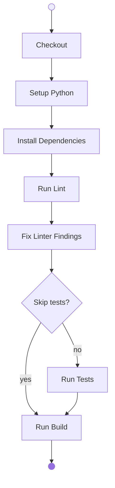
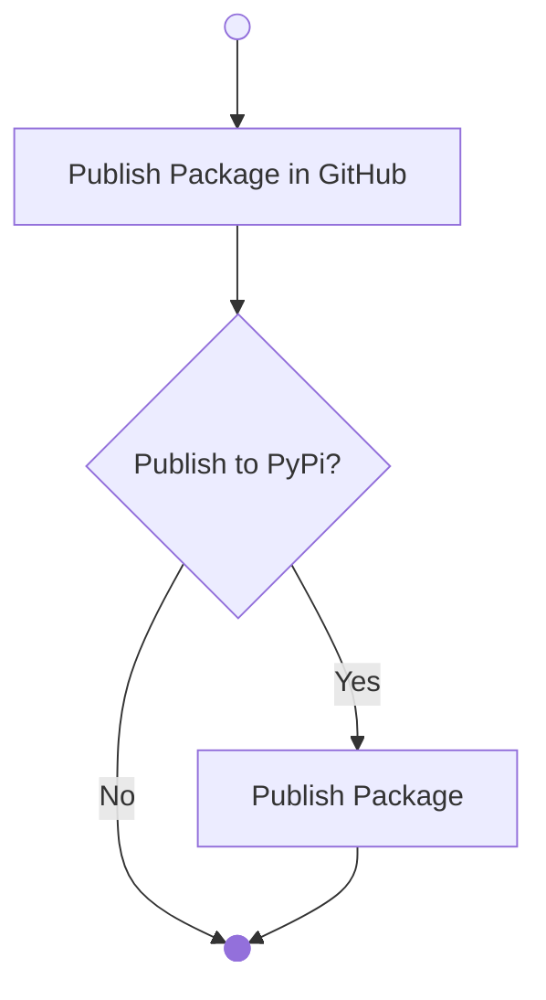

# Setup a Python Project

This section provides a step-by-step guide to setting up a Python project using GitHub Actions. It covers the process of verifying the Python environment, creating and initializing a virtual environment, installing dependencies with Poetry, and running essential tasks such as linting, testing, and building the project. By following these instructions, you will ensure that your Python application is correctly configured and ready for development or distribution.

| **Version Control** | -                          |
| ------------------- | -------------------------- |
| `caprivm`           | <juan.caviedes@neoris.com> |
| Updated             | _May 6, 2025_              |

> [!CAUTION]
> :exclamation: While following the guide, **please do not create any commits**. There's a special section for this.

## Table of Contents

- [Setup a Python Project](#setup-a-python-project)
  - [Table of Contents](#table-of-contents)
  - [Manual Procedure](#manual-procedure)
    - [Execute the Application](#execute-the-application)
  - [Build the Package in GitHub Actions](#build-the-package-in-github-actions)
    - [Actions Catalog](#actions-catalog)
  - [Publish the Package with GitHub Actions](#publish-the-package-with-github-actions)
    - [Actions Catalog](#actions-catalog-1)
  - [Create a Branch and Commit the Changes](#create-a-branch-and-commit-the-changes)
  - [Help (_if needed_)](#help-if-needed)
  - [References](#references)

## Manual Procedure

In this section, taking advantage of the GitHub Codespace, the Python application is executed manually, its correct operation is verified, and a Python package is built for distribution.

Change your package name in the `pyproject.toml` with a `$CUSTOM_NAME` of your preference. For example `CUSTOM_NAME=caprivm`.

```diff
-name = "fastapi-poetry-deploy-example"
+name = "fastapi-poetry-deploy-$CUSTOM_NAME"
```

Verify the Python version

```bash
python -V
```

Access the Python folder

```bash
cd python
```

Create and initialize the Python virtual environment

```bash
python -m venv .venv
source .venv/bin/activate
```

Install [Poetry](https://python-poetry.org/)

```bash
pip install poetry
```

Install dependencies

```bash
poetry install
```

Run lint with [`ruff`](https://docs.astral.sh/ruff/)

```bash
ruff check .
```

Run lint with `--fix` option

```bash
ruff check . --fix
```

Run tests with [`pytest`](https://docs.pytest.org/en/stable/)

```bash
poetry run test
```

Run build

```bash
poetry build
```

> [!TIP]
> If you want to publish the package to a Python Package Index like [`test.pypi`](https://test.pypi.org/) or [`pypi`](https://pypi.org/), you can use the following commands.
>
> ```bash
> poetry config repositories.testpypi https://test.pypi.org/legacy/
> poetry publish --repository testpypi --username __token__ --password ${TEST_PYPI_API_TOKEN} # OPTIONAL | --build --dry-run
> ```

### Execute the Application

If you want to see what the application does, you can run the next command in the `python` subfolder of the project.

```bash
fastapi dev src/main.py --port 8000 --host 0.0.0.0
```

When you access the URL, you should see something similar to the following image.


## Build the Package in GitHub Actions

The exercise consists of following the steps defined in the diagram until producing a Python package.



### Actions Catalog

In this section you will find a catalog of actions to use in implementing the suggested workflow.

| **Action**           | **Source**                                                        |
| -------------------- | ----------------------------------------------------------------- |
| Checkout             | [`actions/checkout`](https://github.com/actions/checkout)         |
| Setup Python         | [`actions/setup-python`](https://github.com/actions/setup-python) |
| Install Dependencies | _Custom_                                                          |
| Run Lint             | _Custom_                                                          |
| Fix Linter Findings             | _Custom_                                                          |
| Run Tests            | _Custom_                                                          |
| Run Build            | _Custom_                                                          |

## Publish the Package with GitHub Actions

Add two steps to the previous job:

- Publish the package as an artifact to GitHub Run
- Publish to [Test PyPi](https://test.pypi.org/)



### Actions Catalog

| **Action**             | **Source**                                                                      |
| ---------------------- | ------------------------------------------------------------------------------- |
| Upload Artifact        | [`actions/upload-artifact`](https://github.com/actions/upload-artifact)         |
| Publish to PyPi Action | [`pypa/gh-action-pypi-publish`](https://github.com/pypa/gh-action-pypi-publish) |

For the _Publish to PyPi Action_ the suggested structure to use is below.

```yaml
- name: Publish Artifact
  uses: pypa/gh-action-pypi-publish@v1.12.4
  with:
    password: ${{ secrets.TEST_PYPI_API_TOKEN }}
    repository-url: "https://test.pypi.org/legacy/"
    packages-dir: "dist/*"
    attestations: true
```

> [!IMPORTANT]
> To publish to Test PyPi we need to set up a `TEST_PYPI_API_TOKEN` that will be the `password` input.
>
> - If we want _trusted publishing_, we need `id-token: write` set in the job. Details of the permissions [here](https://docs.github.com/en/actions/security-for-github-actions/security-guides/automatic-token-authentication#permissions-for-the-github_token).

## Create a Branch and Commit the Changes

At this point create a new branch, add the changes, and make the commits.

> [!IMPORTANT]
> Follow this notation for the branch and for the commit messages.
>
> - **Branch Name**: Start with `dev-`
> - **Commit Message**: Add the keyword `feat:` at the beginning of the message

```bash
git fetch --all
git checkout main
git pull
git checkout -b dev-workshop-first-exercise
git add .
git commit -m "feat: Add the Changes"
git push --set-upstream origin dev-workshop-first-exercise
```

## Help (_if needed_)

This is how each step should look like in order to perform the exercises suggested in the document.

<details>

<summary>Checkout</summary>

```yaml
- name: Checkout Code
  uses: actions/checkout@v4
  with:
    fetch-depth: 0
```

</details>

<details>

<summary>Setup Python</summary>

```yaml
- name: Setup Python
  uses: actions/setup-python@v5
  with:
    python-version: ${{ inputs.python-version }}
```

</details>

<details>

<summary>Install Dependencies</summary>

```yaml
- name: Install Dependencies
  working-directory: "./python"
  run: |
    pip install --upgrade pip
    pip install --upgrade poetry
    poetry install
```

</details>

<details>

<summary>Run Lint</summary>

```yaml
- name: Run Lint
  working-directory: "./python"
  continue-on-error: true
  run: |
    poetry run ruff check .
```

</details>

<details>

<summary>Fix Linter Findings</summary>

```yaml
- name: Fix Linter Findings
  working-directory: "./python"
  run: |
    poetry run ruff check --fix .
```

</details>

</details>

<details>

<summary>Run Tests</summary>

```yaml
- name: Run Tests
  working-directory: "./python"
  if: ${{ inputs.run-tests }}
  run: |
    poetry run test
```

</details>

<details>

<summary>Run Build</summary>

```yaml
- name: Run Build
  working-directory: "./python"
  run: |
    poetry build
```

</details>

<details>

<summary>Upload Artifact to GitHub</summary>

```yaml
- name: Upload Artifact to GitHub
  uses: actions/upload-artifact@v4
  with:
    name: fastapi-poetry-deploy-example-package
    path: "python/dist/*"
```

</details>

<details>

<summary>Publish Artifact to Test PyPi</summary>

```yaml
- name: Publish Artifact
  if: ${{ inputs.publish }}
  uses: pypa/gh-action-pypi-publish@76f52bc884231f62b9a034ebfe128415bbaabdfc # v1.12.4
  with:
    password: ${{ secrets.TEST_PYPI_API_TOKEN }}
    repository-url: "https://test.pypi.org/legacy/"
    packages-dir: "python/dist/*"
    attestations: true
```

</details>

## References

| **Number** | **Name**                       | **Link**                                                                                                                                                         |
| ---------- | ------------------------------ | ---------------------------------------------------------------------------------------------------------------------------------------------------------------- |
| 1          | Poetry Dependency Manager      | [Poetry](https://python-poetry.org/)                                                                                                                             |
| 2          | Ruff Linter                    | [`ruff`](https://docs.astral.sh/ruff/)                                                                                                                           |
| 3          | PyTest Framework               | [`pytest`](https://docs.pytest.org/en/stable/)                                                                                                                   |
| 4          | Test PyPi                      | [`test.pypi`](https://test.pypi.org/)                                                                                                                            |
| 5          | PyPi                           | [`pypi`](https://pypi.org/)                                                                                                                                      |
| 6          | The `github-actions[bot]` User | [`GITHUB_TOKEN`](https://docs.github.com/en/actions/security-for-github-actions/security-guides/automatic-token-authentication#permissions-for-the-github_token) |
