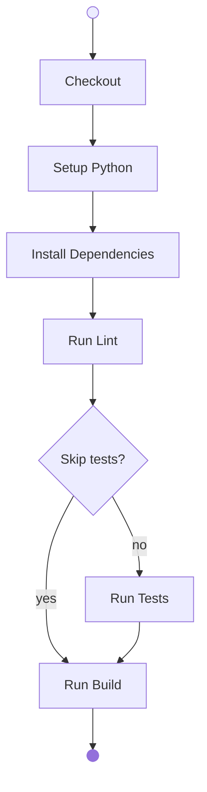

# Setup a Python Project

This section provides a step-by-step guide to setting up a Python project using GitHub Actions. It covers the process of verifying the Python environment, creating and initializing a virtual environment, installing dependencies with Poetry, and running essential tasks such as linting, testing, and building the project. By following these instructions, you will ensure that your Python application is correctly configured and ready for development or distribution.

| **Version Control** | -                          |
| ------------------- | -------------------------- |
| `caprivm`           | <juan.caviedes@neoris.com> |
| Updated             | _May 5, 2025_              |

## Table of Contents

- [Setup a Python Project](#setup-a-python-project)
  - [Table of Contents](#table-of-contents)
  - [Manual Procedure](#manual-procedure)
    - [Execute the Application](#execute-the-application)
  - [First Exercise in GitHub Actions](#first-exercise-in-github-actions)
    - [First: Actions Catalog](#first-actions-catalog)
  - [Second Exercise](#second-exercise)
    - [Second: Actions Catalog](#second-actions-catalog)

## Manual Procedure

In this section, taking advantage of the GitHub Codespace, the Python application is executed manually, its correct operation is verified, and a Python package is built for distribution.

Verify the Python version

```bash
python -V
```

Access the Python folder

```bash
cd python
```

Create and initialize the Python virtual environment

```bash
python -m venv .venv
source .venv/bin/activate
```

Install [Poetry](https://python-poetry.org/)

```bash
pip install poetry
```

Install dependencies

```bash
poetry install
```

Run lint with [`ruff`](https://docs.astral.sh/ruff/)

```bash
ruff check .
```

Run lint with `--fix` option

```bash
ruff check . --fix
```

Run tests with [`pytest`](https://docs.pytest.org/en/stable/)

```bash
poetry run test
```

Run build

```bash
poetry build
```

### Execute the Application

If you want to see what the application does, you can run the next command in the `python` subfolder of the project.

```bash
fastapi dev src/main.py --port 8000 --host 0.0.0.0
```

When you access the URL, you should see something similar to the following image.


## First Exercise in GitHub Actions

The exercise consists of following the steps defined in the diagram until producing a Python package.



### First: Actions Catalog

In this section you will find a catalog of actions to use in implementing the suggested workflow.

| **Action**           | **Source**                                                        |
| -------------------- | ----------------------------------------------------------------- |
| Checkout             | [`actions/checkout`](https://github.com/actions/checkout)         |
| Setup Python         | [`actions/setup-python`](https://github.com/actions/setup-python) |
| Install Dependencies | _Custom_                                                          |
| Run Lint             | _Custom_                                                          |
| Run Tests            | _Custom_                                                          |
| Run Build            | _Custom_                                                          |

## Second Exercise

Add two steps to the previous job:

- Publish the package as an artifact to GitHub Run
- Publish to [PyPi](https://pypi.org/)

### Second: Actions Catalog

| **Action**             | **Source**                                                                      |
| ---------------------- | ------------------------------------------------------------------------------- |
| Upload Artifact        | [`actions/upload-artifact`](https://github.com/actions/upload-artifact)         |
| Publish to PyPi Action | [`pypa/gh-action-pypi-publish`](https://github.com/pypa/gh-action-pypi-publish) |

> [!IMPORTANT]
> To publish to PyPi we need to set up a `PYPI_API_TOKEN`
