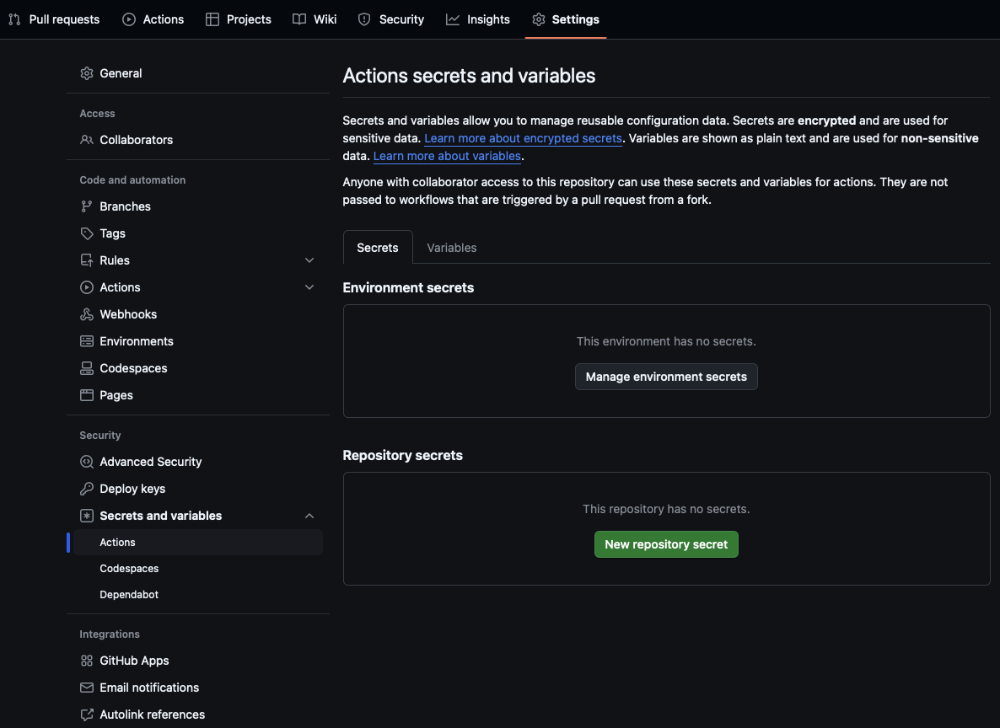

# Secrets and Variables

This document provides guidance on managing secrets and variables in a GitHub repository, specifically for use in GitHub Actions workflows. It explains how to create and configure secrets, such as `PYPI_API_TOKEN`, and variables, such as `GIT_COMMIT_AUTHOR`, at the repository level. Additionally, it includes tips and references to official GitHub documentation for using these secrets and variables effectively in workflows.

| **Version Control** | -                          |
| ------------------- | -------------------------- |
| `caprivm`           | <juan.caviedes@neoris.com> |
| Updated             | _May 6, 2025_              |

## Table of Contents

- [Secrets and Variables](#secrets-and-variables)
  - [Table of Contents](#table-of-contents)
  - [Create a Secret](#create-a-secret)
  - [Create a Variable](#create-a-variable)
  - [Best Practices](#best-practices)

## Create a Secret

In your repository, in the _Settings_ tab, you can modify secrets and variables for three contexts: Actions, Codespaces, and Dependabot. In this exercise, we'll focus only on Actions.



Now, create the `PYPI_API_TOKEN` secret and assign it an appropriate value. To use the secret in a GitHub Actions workflow follow [these instructions](https://docs.github.com/en/actions/security-for-github-actions/security-guides/using-secrets-in-github-actions#using-secrets-in-a-workflow).

## Create a Variable

In the same page, let's create the `GIT_COMMIT_AUTHOR` variable at repository level. An example of the value below. To use the variable in a GitHub Action workflow follow [these instructions](https://docs.github.com/en/actions/writing-workflows/choosing-what-your-workflow-does/store-information-in-variables#using-the-vars-context-to-access-configuration-variable-values).

```txt
Juan Caviedes <juan.caviedes@neoris.com>
```

## Best Practices

- Avoid hardcoding sensitive information in workflows.
- Regularly rotate secrets.
- Use descriptive names for variables.
- Grant the least privilege necessary when configuring secrets and variables.
- Audit and review secrets and variables periodically to ensure they are still needed.
- Use environment-specific secrets and variables to avoid accidental usage in the wrong context.
- Document the purpose of each secret and variable for better maintainability.
- Avoid sharing secrets and variables across repositories unless absolutely necessary.
- Use GitHub's built-in tools, such as secret scanning, to detect exposed secrets in your codebase.

## References

| Number | Name                  | Link                    |
| ------ | --------------------- |-|
| 1 | Secrets in GitHub Actions  | [Secrets Management and Operation](https://docs.github.com/en/actions/security-for-github-actions/security-guides/using-secrets-in-github-actions#using-secrets-in-a-workflow) |
| 2 | Variables in GitHub Actions | [Variables Management and Operation](https://docs.github.com/en/actions/writing-workflows/choosing-what-your-workflow-does/store-information-in-variables#using-the-vars-context-to-access-configuration-variable-values) |
