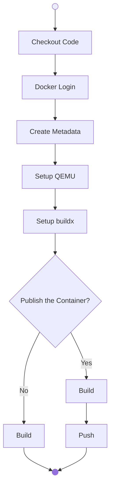

# Dockerize the Python Project

This section provides a step-by-step guide to containerizing a Python project using Docker. It covers both manual procedures and automation through GitHub Actions. You'll learn how to build a multi-stage Docker image, configure environment variables, and run the application locally. Additionally, the guide includes instructions for creating a GitHub Actions workflow to automate the containerization process, leveraging popular Docker-related actions. By the end of this section, you'll have a fully functional Docker container ready for deployment.

| **Version Control** | -                          |
| ------------------- | -------------------------- |
| `caprivm`           | <juan.caviedes@neoris.com> |
| Updated             | _May 6, 2025_              |

> [!CAUTION]
> :exclamation: While following the guide, **please do not create any commits**. There's a special section for this.

## Table of Contents

- [Dockerize the Python Project](#dockerize-the-python-project)
  - [Table of Contents](#table-of-contents)
  - [Manual Procedure](#manual-procedure)
    - [Execute the Application](#execute-the-application)
  - [Create the Docker Container in GitHub Actions](#create-the-docker-container-in-github-actions)
    - [Actions Catalog](#actions-catalog)
  - [Create a Branch and Commit the Changes](#create-a-branch-and-commit-the-changes)
  - [Help (_if needed_)](#help-if-needed)
  - [References](#references)

## Manual Procedure

> [!CAUTION]
> Because we are using [`chainguard`](https://images.chainguard.dev/directory/image/python/versions), this version should be the latest minor version of Python. At the time of writing the workflow, the version is 3.13.

To Dockerize the example project, you should be aware of what is happening in the [`Dockerfile`](../../python/Dockerfile). Some characteristics of the `Dockerfile`.

- It's a multi-stage build, so there's a `dev` image where the application is built, and a final image where the application runs.
- There's an `ARG` called `PYTHON_VERSION` in case the Python version changes for the images used.
- The registry, name, and version are chosen when running the `docker build` command.

Set the credentials

```bash
export DOCKER_HUB_USERNAME=caprivm
export DOCKER_HUB_TOKEN=
```

Login to the registry

```bash
docker login docker.io -u $DOCKER_HUB_USERNAME -p $DOCKER_HUB_TOKEN
```

Build the container

```bash
docker build \
--build-arg PYTHON_VERSION=3.13 \
--tag fastapi-poetry-deploy-example:latest \
-f python/. .
```

> [!TIP]
> If you want to publish the container to [Docker Hub](https://hub.docker.com/) you can use the following commands.
>
> ```bash
> docker push fastapi-poetry-deploy-example:latest
> ```

### Execute the Application

Run the container locally

```bash
docker run -d -p 8000:8000 \
--name fastapi-poetry-deploy-example \
fastapi-poetry-deploy-example:latest
```

Now, check if the application is running in `http://localhost:8000`. You should see a result similar to [this section](./2-setup-example-project.md#execute-the-application).

## Create the Docker Container in GitHub Actions

> [!IMPORTANT]
> Create all the suggested steps in a new job in the same [workflow file](../../.github/workflows/build-application.yaml).

The exercise consists of following the steps defined in the diagram until producing a Docker container.



### Actions Catalog

In this section you will find a catalog of actions to use in implementing the suggested workflow.

| **Action**      | **Source**                                                             |
| --------------- | ---------------------------------------------------------------------- |
| Checkout        | [`actions/checkout`](https://github.com/actions/checkout)              |
| Docker Login    | [`docker/login-action`](https://github.com/docker/login-action)        |
| Docker Metadata | [`docker/metadata-action`](https://github.com/docker/metadata-action)  |
| Setup QEMU      | [`setup-qemu-action`](https://github.com/docker/setup-qemu-action)     |
| Setup `buildx`  | [`setup-buildx-action`](https://github.com/docker/setup-buildx-action) |
| Build and Push  | [`build-push-action`](https://github.com/docker/build-push-action)     |

> [!IMPORTANT]
> To publish to Docker Hub we need to set up a `DOCKER_HUB_TOKEN` that will be the `password` to push the container.
>
> - If we want _trusted publishing_, we need `id-token: write` set in the job. Details of the permissions [here](https://docs.github.com/en/actions/security-for-github-actions/security-guides/automatic-token-authentication#permissions-for-the-github_token).

## Create a Branch and Commit the Changes

At this point create a new branch, add the changes, and make the commits.

> [!IMPORTANT]
> Follow this notation for the branch and for the commit messages.
>
> - **Branch Name**: Start with `dev-`
> - **Commit Message**: Add the keyword `feat:` at the beginning of the message

```bash
git fetch --all
git checkout main
git pull
git checkout -b dev-workshop-first-exercise
git add .
git commit -m "feat: Add the Changes"
git push --set-upstream origin dev-workshop-first-exercise
```

## Help (_if needed_)

This is how each step should look like in order to perform the exercises suggested in the document.

<details>

<summary>Checkout</summary>

```yaml
- name: Checkout Code
  uses: actions/checkout@v4
  with:
    fetch-depth: 0
```

</details>

<details>

<summary>Docker Login</summary>

```yaml
- name: Docker Login
  uses: docker/login-action@v3
  with:
    username: ${{ vars.DOCKER_HUB_USERNAME }}
    password: ${{ secrets.DOCKER_HUB_TOKEN }}
```

</details>

<details>

<summary>Docker Metadata</summary>

```yaml
- name: Docker Metadata
  id: meta
  uses: docker/metadata-action@v5
  with:
    images: docker.io/fastapi-poetry-deploy-example
    tags: |
      type=raw,value=0.3.0
      type=raw,value=latest
```

</details>

<details>

<summary>Setup QEMU</summary>

```yaml
- name: Setup QEMU
  uses: docker/setup-qemu-action@v3
```

</details>

<details>

<summary>Setup Docker buildx</summary>

```yaml
- name: Setup Docker Buildx
  uses: docker/setup-buildx-action@v3
```

</details>

<details>

<summary>Build and Push the Container</summary>

```yaml
- name: Build and Push
  uses: docker/build-push-action@v6
  with:
    context: "python/."
    push: ${{ inputs.publish }}
    tags: ${{ steps.meta.outputs.tags }}
    labels: ${{ steps.meta.outputs.labels }}
```

</details>

## References

| **Number** | **Name**                       | **Link**                                                                                                                                                         |
| ---------- | ------------------------------ | ---------------------------------------------------------------------------------------------------------------------------------------------------------------- |
| 1          | Chainguard _base-images_       | [`chainguard`](https://images.chainguard.dev/directory/image/python/versions)                                                                                    |
| 2          | `docker.io` Registry           | [Docker Hub](https://hub.docker.com/)                                                                                                                            |
| 3          | The `github-actions[bot]` User | [`GITHUB_TOKEN`](https://docs.github.com/en/actions/security-for-github-actions/security-guides/automatic-token-authentication#permissions-for-the-github_token) |
